# Active-Directory-Domain---GPO-Lab
Connect a Windows 11 Workstation to a Windows Server Domain and manage it with GPO's.

## Environment & Specifications:

* **Goal**: Establish a domain to connect and manage a Windows 11 Workstation and its User’s with Control Panel Restriction and Mapping a Network Drive GPO’s. 
* **Platform**: VMware Workstation (VMnet2 Host-Only) using Windows Server 2025 and Windows 11 Enterprise. 
* **Network Types**: Host-Only (VMnet2) treated as a “sandbox” for isolation. 
* **Subnet**: 10.0.0.0/24 with DHCP Disabled. 

---

## 1. Network Setup

Created an isolated Host-Only network named “VMnet2” for Windows Server 2025 and Windows 11 Workstation for this home lab. 

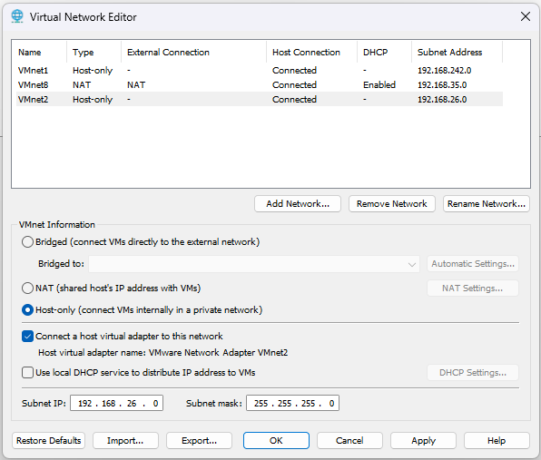 

## 2. Server IP Configuration

Adding a static IP address to the server (10.0.0.1) is essential for the management of devices on that server for company workflow. The IP address of this server should be static so that user devices can find it for proper connection and management. The Server is its own DNS. 

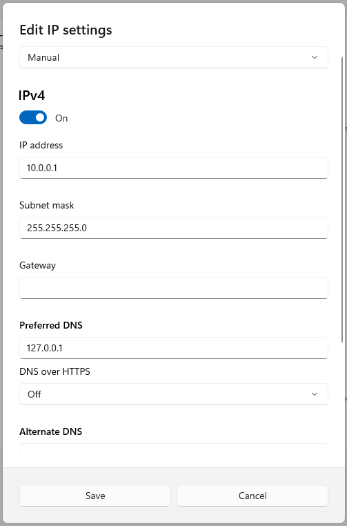 

## 3. AD DS Configuration

As I went through the AD DS Configuration Wizard for installation I set the Root Domain Name as “nate.local”. 

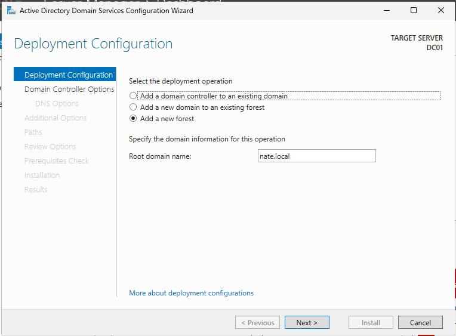 

## 4. Prerequisites Check (Problem & Solution)

As I continued with the AD DS Configuration Wizard, it was time for the Prerequisites Check. I ran into an issue that the administrator password was either blank or too weak for security reasons. 

* **The Conflict**: 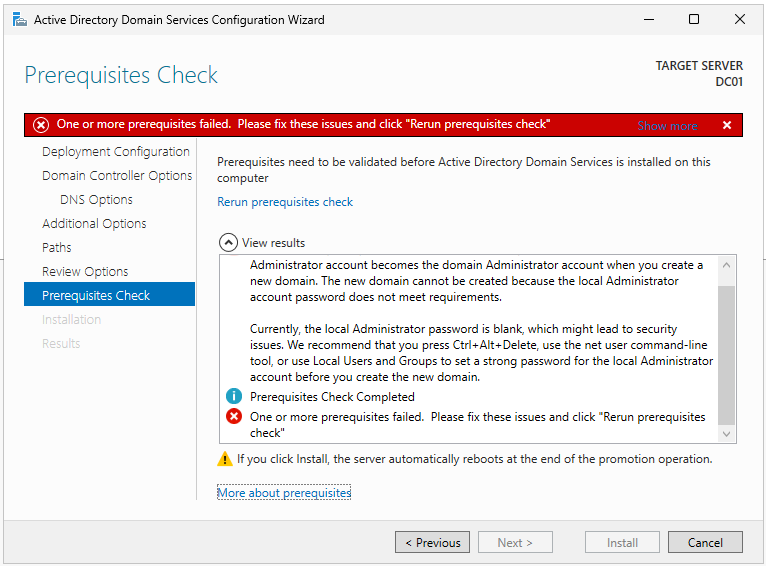 

For this instance, I had to set a password for the administrator since it did not have one yet. After I set it, I ran the Prerequisites Check again and all prerequisites passed the check successfully. 

* **The Fix**: 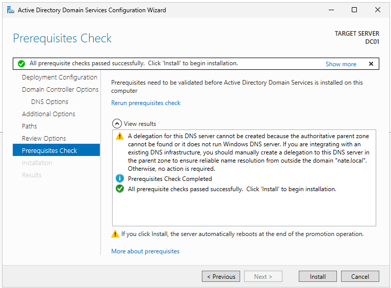 

## 5. Organizational Units (Problem & Solution)

As I was setting up Organization Units (“_Employee”, “_Workstations”, “_Groups”), I made a mistake and created the “_Workstations” OU under the “_Employees” OU by accident. I tried to delete the “_Workstations” OU to fix the issue but a message appeared stating I don’t have the sufficient privileges to delete this OU. 

* **The Conflict**: 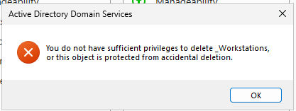 

To fix this I had to go into the Advanced Features of the “_Workstations” OU and uncheck the box that protected the object from accidental deletion. This box is automatically checked whenever you create a new OU or Object in AD so you don’t accidentally delete something that could cause destruction to the rest of the Objects. 

* **The Fix**: 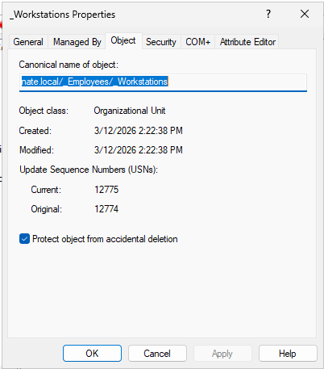 
* **Final Structure (SS#8)**: 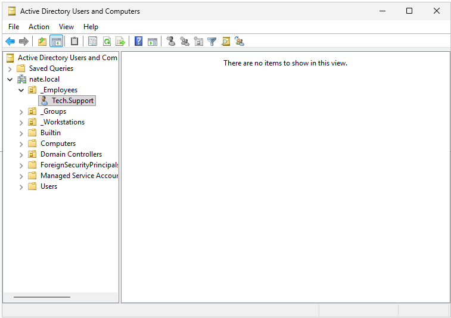 

## 6. Connectivity Troubleshooting

Once I got the Windows 11 Workstation VM up and running and putting it on the same Host-Only network (VMnet2) as the Windows Server 2025 VM, I tried adding it to the Domain (“nate.local”) but received an error stating the domain could not be found contacted. 

* **The Conflict**: 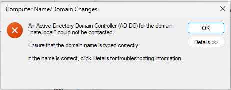 

To resolve this issue, I began by running an “nslookup” of the domain on the Windows Server 2025, but the request timed out. But I realized that the address for the server was a loopback address for IPv6 and not the IPv4 address I assigned it (127.0.0.1). To fix this, I turned off IPv6 services completely on both VMs so there aren’t any more complications for connection to the domain. So, I ran the command again and the information was correct this time, but it didn’t solve the issue. I was still getting the same error message as before when trying to connect to the domain. 

Since the error message was still there and both VMs still can’t see each other, I thought maybe the VM network was the issue. So, I changed the Host-Only network (VMnet2) on both VMs to a LAN Segment (Internal-lab) and tried joining the domain once again. But I still got the error message. 

### Resolution:

After doing all this troubleshooting, I finally found the issue. I checked each VMs IP address to see if they were configured properly. But I forgot to give the Windows 11 Workstation VM a static IP address with the same subnet and a default gateway. After I did that, I pinged each VM and they could communicate with each other. I then tried joining the domain once more and the problem was solved! 

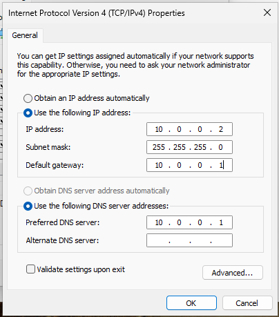
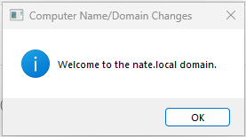

## 7. GPO Implementation

Once I got the Windows 11 Workstation VM on the domain (“nate.local”), I made a GPO named “Restrict_Control_Panel” for the workstation and the user “Tech.Support” that prohibits access to the control panel. Once I linked that GPO to the user (“Tech.Support”), I verified to see if it worked by going on the Windows 11 Workstation VM and trying to access the control panel and received a restrictions message. 

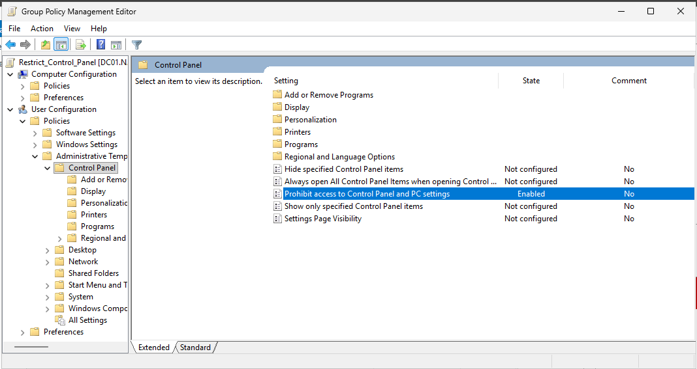
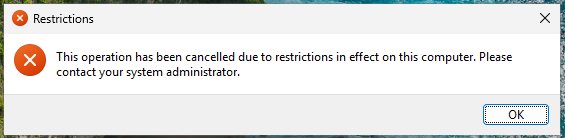

With some more practice I tried mapping an “S:” drive named “Company Files” to that workstation. I created a GPO that did just that and linked it to the user’s workstation. I went and verified if it worked and it was a success! 

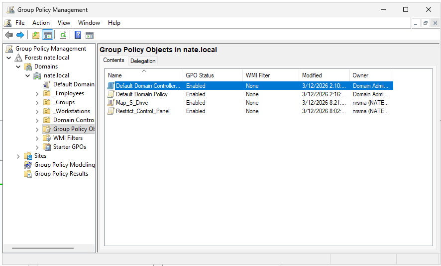
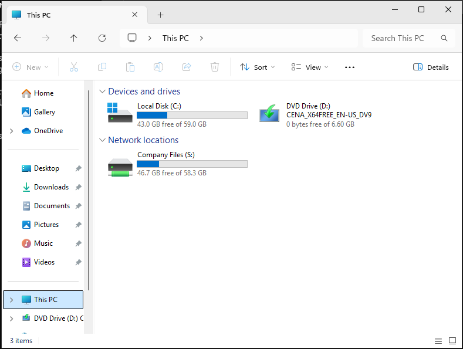
